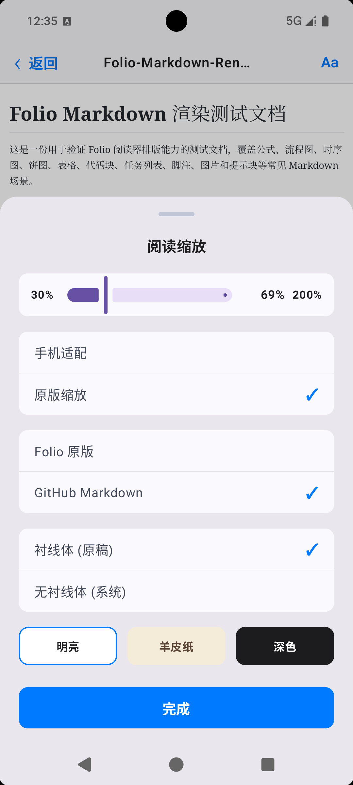
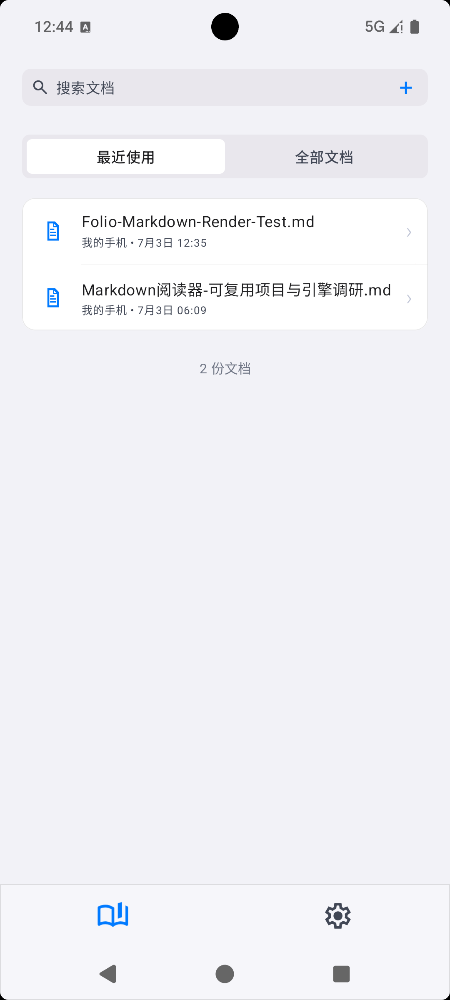
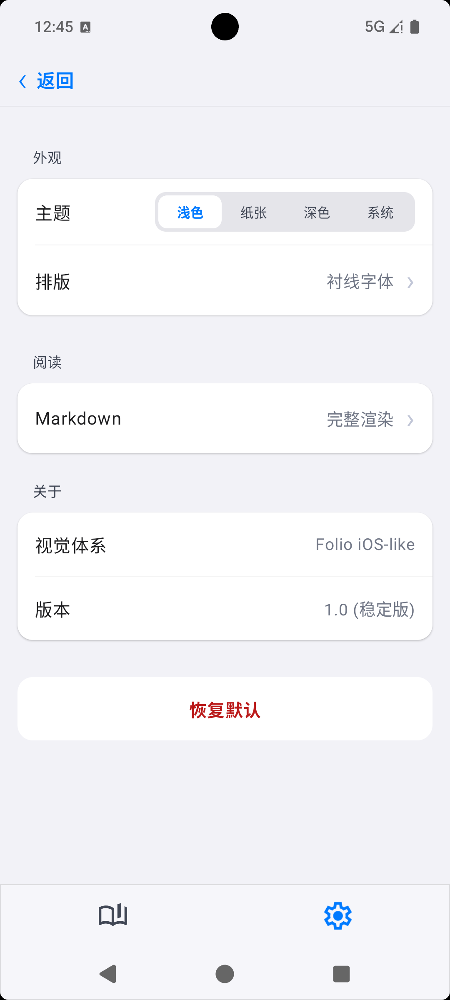

# Folio

Folio 是一款面向 Android 的本地 Markdown 阅读器，视觉体系定位为 **Folio iOS-like**：轻量、克制、清晰，尽量让移动端阅读体验接近系统级文档 App。

它支持本地 Markdown 文档导入、最近阅读记录、分页阅读、阅读缩放、主题切换，以及公式、表格、任务列表、Mermaid 图表等常见 Markdown 场景。

## 项目效果

<p align="center">
  
  
  
  
</p>

## 功能特性

- 本地 Markdown 文档导入、最近使用、全部文档管理。
- CommonMark / GFM 内容渲染，支持表格、任务列表、代码块、脚注、提示块等扩展语法。
- KaTeX 数学公式渲染，支持行内公式与块级公式。
- Mermaid 图表渲染，包含流程图、时序图、饼图、甘特图等移动端展示优化。
- 大文件分块分页阅读，减少一次性渲染带来的卡顿和内存压力。
- WebView 离线渲染链路，内置 KaTeX、Mermaid、GitHub Markdown CSS 等资源。
- 阅读缩放、主题模式、字体排版等设置，适配手机阅读场景。
- Folio iOS-like 视觉体系，包含浅色、纸张、深色、系统主题。

## 版本更新

### 1.0.0 稳定版

- 明确 Folio iOS-like 视觉体系，统一首页、设置页、阅读器和底部操作面板的界面风格。
- 优化 Markdown 阅读器，补充数学公式、图表、表格、任务列表和大文件分页场景。
- 优化 Mermaid 甘特图移动端布局，按显示区域统一缩放元素，减少重叠和拥挤。
- 修复任务列表渲染中 checkbox 前出现多余列表黑点的问题。
- 收敛阅读器状态流，拆分 ViewModel，提升配置变更和状态恢复稳定性。
- 补充可访问性语义与单元测试，降低 AI 生成代码的维护风险。
- 增强 WebView 安全策略，限制不受支持的文档 URI，并对远程图片加载进行兜底控制。

## 构建

```powershell
.\gradlew.bat assembleDebug
```

构建完成后，Debug APK 位于：

```text
app/build/outputs/apk/debug/app-debug.apk
```

## 仓库说明

本仓库只提交 Android 项目源码与必要文档资源，不包含本地签名文件、`local.properties`、Gradle 构建产物或 IDE 缓存。
